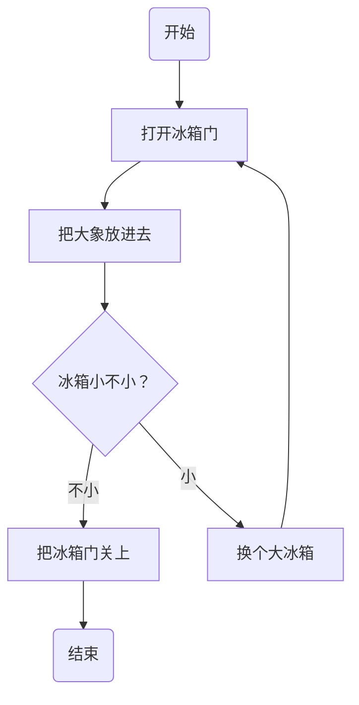

o——主要课程与维飒相同。多了一个组合数学，这门课不简单，当年清华大学计算机系最容易挂科的就是数据结构和组合数学。

——没有文体课，也没有文史课，这是很大缺陷。本来就担心你偏科。文体课直接找找老师求情，就说导师出的主意——有些事情要尽力办成。文史课很多，总可以选一个。

——研究生阶段，要逐步摆脱对教师授课的依赖，锻炼自学能力。退一步，既然何苯讲课那么差，而信息检索导论据说斯坦福大学有公开课，应该看看讲课视频，一举多得。机器学习也有著名的吴恩达讲课视频，配合向老师的讲课肯定效果更好。

——课外读书就是自学。《编程珠玑》《代码大全》《设计模式》《编程珠玑》都是经典。

——读研时要读点有难度的书，否则以后很难读进去了。

——Learning from peers。